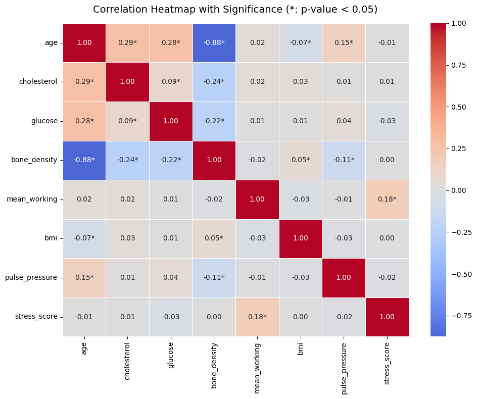
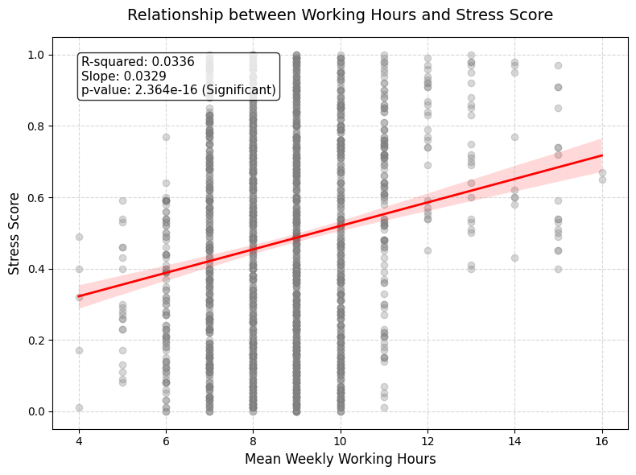
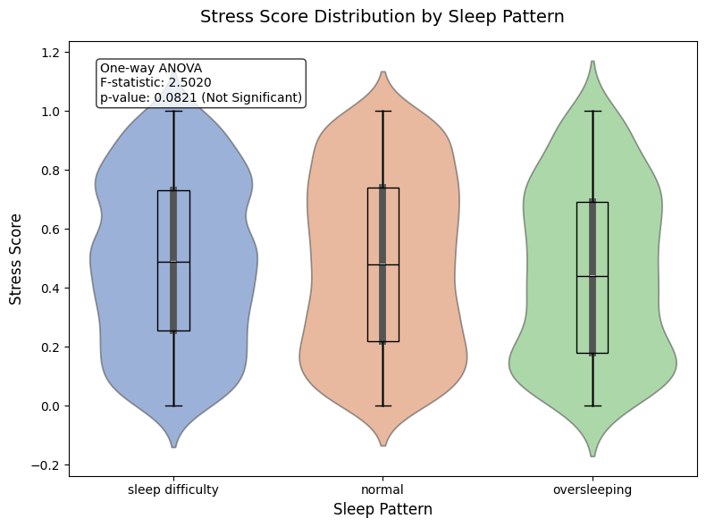

# The plan

## Project Steps

| Step                    | Description                                                                                                                                              |
| ----------------------- | :------------------------------------------------------------------------------------------------------------------------------------------------------- |
| 1. Data Collection      | 데이터를 수집하고 feature 특성에 따른 기본 전처리를 진행한다.                                                                                            |
| 2. Data Cleaning        | 누락데이터 및 데이터 일관성을 확보                                                                                                                       |
| 3. Exploratory Analysis | 특성간 상관도, 경향성을 파악하기 위한 시각화                                                                                                             |
| 4. Handling Imbalances  | 데이터 불균형 처리(SMOTE)                                                                                                                                |
| 5. Feature Engineering  | 의미있는 특성들을 위한 특성공학진행                                                                                                                      |
| 6. Model Building       | 모델훈련, 분류/회귀 진행                                                                                                                                 |
| 7. Evaluation           | 평가지표를 통한 성능측정(F1, AUC-ROC 등)                                                                                                                 |
| 8. Causal Analysis      | - Granger Causality : "무엇이 진짜 원인이고 결과인가?"를 통계적으로 검증 <br> - Propensity Matching : 인과관계 유추를 위해 데이터를 공정하게 맞추는 기법 |
| 9. Visualization        | 데이터 시각화                                                                                                                                            |

---

### 8번 Causal Analysis(인과관계 분석)의 의미

**① Granger Causality (그랜저 인과성 테스트)개념**: "원인은 결과보다 항상 시간적으로 앞서 발생한다"는 가정을 바탕으로 하는 시계열 데이터 분석 기법.
단순히 과거의 스트레스 점수($B_{past}$)만 가지고 미래의 스트레스 점수($B_{future}$)를 예측할 때보다 수면데이터를 넣었을 때 예측 정확도가 통계적으로 유의미하게 향상되었다면 "수면 부족이 스트레스 증가에 영향을 주었다(Granger-cause)"고 판단할 수 있다.

**② Propensity Score Matching (성향 점수 매칭)개념**: 실험실처럼 통제된 환경이 아닌 일반 데이터(관찰 데이터)에서 인과관계를 유추하기 위해 비교 대상을 공정하게 맞추는 기법. 즉, '주당 60시간 이상 근무하는 그룹(실험군)'과 '정시 퇴근하는 그룹(대조군)'의 스트레스 지수를 그냥 비교하면 불공평하다. 나이, 성별, 학력 등 다른 조건이 거의 흡사한 사람들을 데이터 안에서 1:1로 짝을 지어(Matching) 그룹을 재구성하고 오직 '근로 시간'의 차이만 남겨두고 스트레스 점수를 비교함으로써, "근로 시간 증가가 스트레스 상승의 순수한 원인인가?"를 밝혀낼 수 있다.

> 6번과 7번 단계가 "건강 데이터를 주면 스트레스 점수를 정확하게 맞추는 모델을 만드는 것"이 목적이라면, 8번 단계는 "스트레스 점수를 낮추기 위해 수면, 근로 시간, 혈압 중 어떤 요인을 우선적으로 해결(케어)해야 하는가?"라는 근본적인 원인을 도출하는 단계이다.

## 1. Data Collection

## 2. Pre-processing

- 특성 수 : 16
- 전체 훈련 데이터셋 : 3000

| Column Name              | Type    | Description            |
| ------------------------ | ------- | ---------------------- |
| ID                       | object  | 샘플별 고유 ID         |
| gender                   | object  | 성별                   |
| age                      | int64   | 연령                   |
| height                   | float64 | 키(cm)                 |
| weight                   | float64 | 몸무게(kg)             |
| cholesterol              | float64 | 콜레스테롤 수치        |
| systolic_blood_pressure  | int64   | 수축기 혈압            |
| diastolic_blood_pressure | int64   | 이완기 혈압            |
| glucose                  | float64 | 혈당 수치(mg/dL)       |
| bone_density             | float64 | 골밀도(g/cm²)          |
| activity                 | object  | 생활시 운동 강도       |
| smoke_status             | object  | 흡연 상태              |
| medical_history          | object  | 만성질환               |
| family_medical_history   | object  | 가족력                 |
| sleep_pattern            | object  | 수면패턴               |
| edu_level                | float64 | 학력                   |
| mean_working             | float64 | 1주일당 평균 근로 시간 |
| stress_score (target)    | float64 | (TARGET) 스트레스 점수 |

## 3. Data Check > Cleaning

### 1) 데이터 형식 변경

- 범주형데이터의 경우, object > category
  ( LightBGM의 경우 category로 되어 있다면 자동으로 범주화 및 레이블인코딩을 진행하는 특성을 활용 )

- 특성추가
  - 신장과 체중 > BMI지수
  - 이완/수축기 혈압 > 맥압 / 평균혈압

### 2) 결측치처리

```
 #   Column                  Non-Null Count  Dtype
---  ------                  --------------  -----
 0   medical_history         1711 non-null   object # 만성질환이 없을 가능성
 1   family_medical_history  1514 non-null   object # 가족력이 없을 가능성
 2   edu_level               2393 non-null   object # 박사 또는 중졸이하일 가능성.
 3   mean_working            1968 non-null   float64 # 단순누락 가능성
```

- 의료기록, 학력관련 범주 : 없을 수 있는 데이터, none으로 채우기
- 평균근로시간 : median 값으로 채우기

### 3) 이상치처리

- 체중 : 최소값이 36kg언저리. 낮긴 하지만 발생가능성은 존재. 유지
- 근로시간 : 최대값이 16시간 언저리. 나도 그런 적 있으므로. 유지
- 혈압 : 수축기와 이완기의 숫자가 모두 살짝 이상하므로... 혹여나 뒤집힌(오기재) 것이 없는지 확인 >> 없음

### 4) 데이터 불균형

- 대상의 연령분포는 안정적임.
- 특성별로 이렇다 할 쏠림이 없음.

## 4. Training

- baseline 코드를 그대로 따름.

## 5 Result

- K-fold : **5-Fold Average RMSE: 0.243725**
  - Fold 1 RMSE: 0.232382
  - Fold 2 RMSE: 0.243364
  - Fold 3 RMSE: 0.244271
  - Fold 4 RMSE: 0.252484
  - Fold 5 RMSE: 0.246123

## To Do

- 골밀도-연령 이외의 특성간 상관관계는 거의 존재하지 않음 → 복합지표 또는 특성추출을 적용해볼 필요성이 있어보임.
  

- 빨간색 회귀선이 우상향하고 있음 → 주당 평균 근무 시간이 늘어날수록 스트레스 지수가 평균적으로 상승하는 경향이 뚜렷함.
  

- One-way ANOVA (F-statistic: 2.5020, p-value: 0.0821)
  → 통계적으로 유의미하지 않음 (Not Significant)
  
